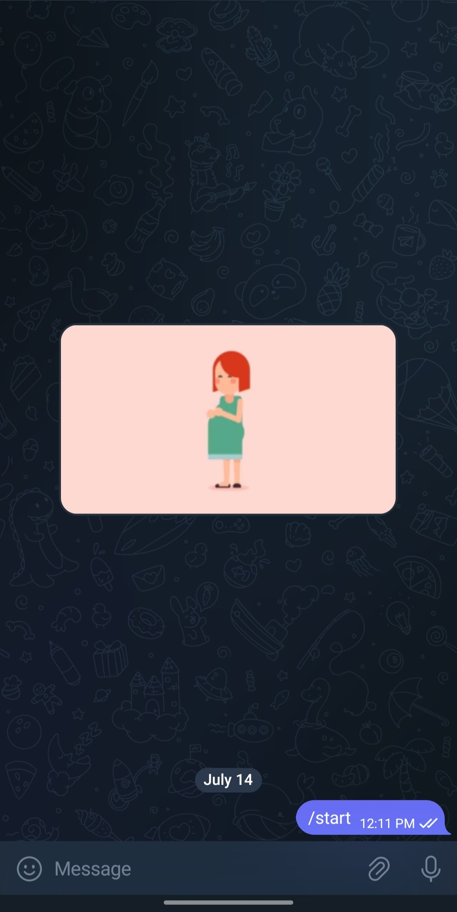
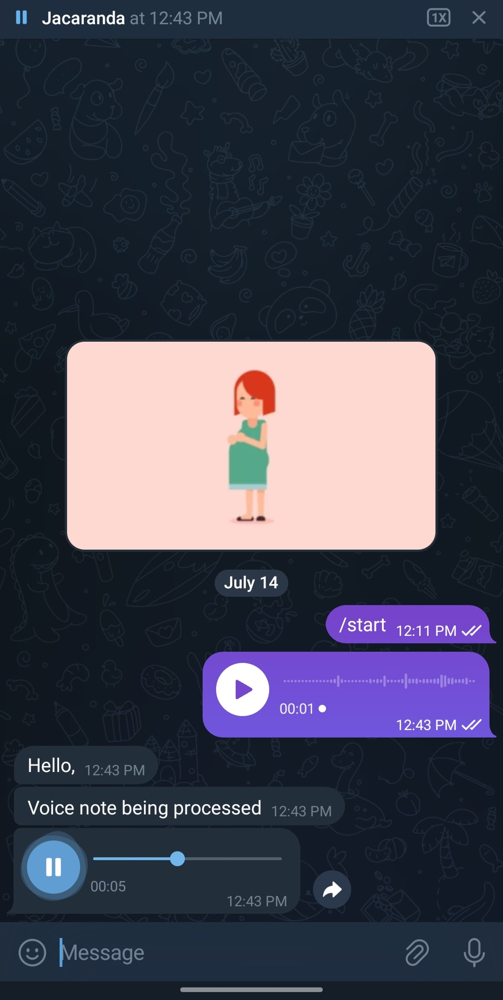

# Audio-Inferencing: 
*Telegram Voice Note Bot for LLM Inferencing*

### Overview
This repository contains a Telegram bot that captures voice notes sent by users, transcribes them to text, infers a response using a Large Language Model (LLM) like Gemini Pro, and responds back with a voice note.

###  Architecture (V4 Current)
The system consists of the following components:
- Telegram Bot: 
	- Receives voice notes from users.
	- Response: The generated voice note is returned to the user via the bot.
- Voice Note to Text: The received voice note is transcribed to text using [Whisper](https://huggingface.co/openai/whisper-base).
- LLM Inference: The transcribed text is passed to the [Gemini Pro](https://deepmind.google/technologies/gemini/pro/) LLM for inference.
- Text to Voice Note: The output of the LLM is converted to a voice note using [ElevenLabs](https://elevenlabs.io/).


### Implementation

The implementation is written in [insert programming language, e.g. *Python 3.9.19* and uses the following libraries:
``` python
	transformers
	python-dotenv
	torch
	torchaudio
	google-generativeai==0.7.2
	librosa==0.10.2.post1
	python-telegram-bot==13.15
	speechbrain
	torchvision
	pydub
```

### Usage

To use this application, follow these steps:

1.  Clone the repository and install the [required dependencies](requirements.txt).
2.  Run the application using  `python telegram_v1.py`  in your terminal or command prompt.
3.  Access the Telegram bot via the provided [link](https://t.me/sitol_bot). "https://t.me/sitol_bot"
4.  Send a voice note to the bot to initiate a conversation.
---
#### General manual/guide
1. Step 1: Install Telegram from Playstore (This bot is yet to be tested on the IOs Platform).
2. Step 2: Access bot via provided link and tap/click start at the bottom of the screen.
<div style="text-align: center;">

</div>
3. Step 3: **Hold** the mic icon (button) (bottom right) to record and send a message. Pro-tip, start recording a message as soon as the mic button is held.
<div style="text-align: center;">

</div>
<br>
<div style="text-align: center;">

</div>


---

####  Activities

|Task        							|Description                    			|Status (Activities / Solution)|
|-----------------------------------	|-----------------------------------------	|-----------|
|Improve audio cleaning    				|`Resolve background noise issues`   	    |Done (No longer an issue with Whipser)  |
|Migrate to Faster Whisper  for STT		|`For multilingual caps`            	    |Done (Using Base model) |
|Resolve Audio cut issue	        	|`Sometimes audio sent back is cut at 10s`  |Done (Limit token count)	|
|Integrate Whatsapp Platform       		|											|Ongoing (Resolve media download, Add voice reponse)|        
|Test on UlizaLlamma3					|`Long inf times on CPU. Needs GPU: 45bg+ for 6 - 10 minute inf times`	|Done(Back to using Gemini/Pro)|
|Migrate to using Elevenlabs for TTS	|`Much more Human-like audio`				|Done(Back to using Gemini/Pro)|
|Deployment								| `Deploy version 4: Whisper -> GeminiPro -> ElevenLabs`	|Ongoing|


#### License
This repository is licensed under **TBD**


#### Dir Structure:
- Audio Inferencing
    - `assets/`             : Contains general media files for repo documentation
	- `helpers/`			: Helper function for inferencing opps
    - `models/`             : Contains model bin/safe-tensor/ckpt files (only for open source models)
    - `Notebooks/`          : Traning and Draft Jupyter notebooks
    - `outputs`             : Temp location for inspecting wav, mp3 & ogg files during tests
    - `pretrained_models/`  : Contains model configuration files (only for open source models)
    - `run_files`           : Temp location for storing bot media files during telegram inferencing
    - `samples`             : Sample audio files (wav, mp3, flac & ogg)
	* telegram_v1.py :	Initial pipeline runing on Wav2Vec2, Gemini, Speechbrain. Challenges:
		* STT Voice Clarity Changes
		* Gemini Dependant on STT quality i.e. Bad Text == Bad Inference : _GIGO_
	* telegram_v2.py :	Pipeline runing on Wav2Vec2, Mistral, Speechbrain. Challenges:
		* STT Voice Clarity Changes
		* Mistral Long Inference Times (Localy Hosted)
	* telegram_v3.py :	Pipeline runing on Whsiper, Gemini, Speechbrain. 
		* Better STT results for English
		* Improved Gemini inference based on better STT text inputs
		* TTS being robotic in certain instnaces
		* Random Text Truncation with long Gemini Responses e.g. on query `What is malaria best known for`, Speechbrain TTS cuts at 6 seconds. Could be an issue with the wav handling and not TTS conversiton itself.
	* telegram_v4.py :	Current **stable** pipeline runing on Whisper, GeminiPro  and ElevenLabs.
		* Significantly better TTS results with much more human like voices


--------

### Findings

#### Audio Handling

##### Device-Specific Considerations:

Microphone Quality: Devices with low-quality microphones may require additional noise reduction techniques or more robust STT models to improve performance. <br>
Processing Power: Only an issue when running local inferences. Payed alternatives may be cheaper in scllled up scenarios. <br>
Memory Constraints: Same as above. Howevr the likes of Tacotron dont require 'highend' hardware. Infreceing is possible on CPU.

##### Speech-to-Text (STT):

Language Support: Swahili is a less-resourced language, there is a limited amount of models that can aid. Metas solutions are greate but running localy is not an option. <br>
Accent and Dialect: Both Swahili & English have various accents and dialects, which can affect STT performance. Either traain/tune modesl on variety of speakers OR add as model consideration. <br>
Noise Robustness: Devices with low-quality microphones may introduce noise into the audio signal, which can negatively impact STT performance. Can be resolved by using robust STT models that can handle noisy audio e.g. Whiper `Base` or `Large`. <br>
Audio Quality: The quality of the audio signal can significantly impact STT performance. 

##### Text-to-Speech (TTS):

Language Support: Low resource languages not currently a major focus with most availble open-source & closed models. This means other issues like tonation may be difficult to achieve. <br>
Audio Format: Telegram, WhatsApp and Other similar services use custom file formats (e.g. `OGG` ) to esnure less data use when transmiting files as well as minimal storage on host device. This means audio isn't 'lossless'. When inferencing queries audio may need to be conveted to `WAV` a conventional format, however this dosent resolve any audio quality issue caused by the likes of `OGG` formats. <br>

#### LLM Inferecning
_TODO_

----


